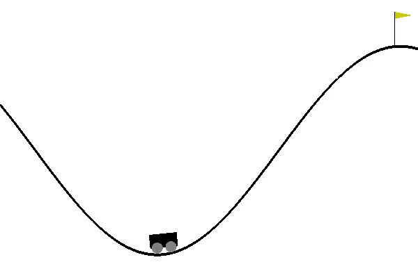

# MountainCar

This repository contains implementations of algorithms that solve a classic reinforcement learning problem - mountain car. The environment is provided by the OpenAI Gym (MountainCar-v0). 

The goal of the task is to drive up the mountain on the right. Since the car's engine is not strong enough to scale the mountain in a single pass, the only way to succeed is to learn to leverage the gravity, and drive back and forth to build up momentum. For any given state (position and velocity) of the car, the agent is given the choice of driving left, driving right, or not using the engine at all. The agent receives a negative reward at every step when the goal is not reached. 

MountainCar-v0 defines "solving" as getting average reward of -110.0 over 100 consecutive trials. 

